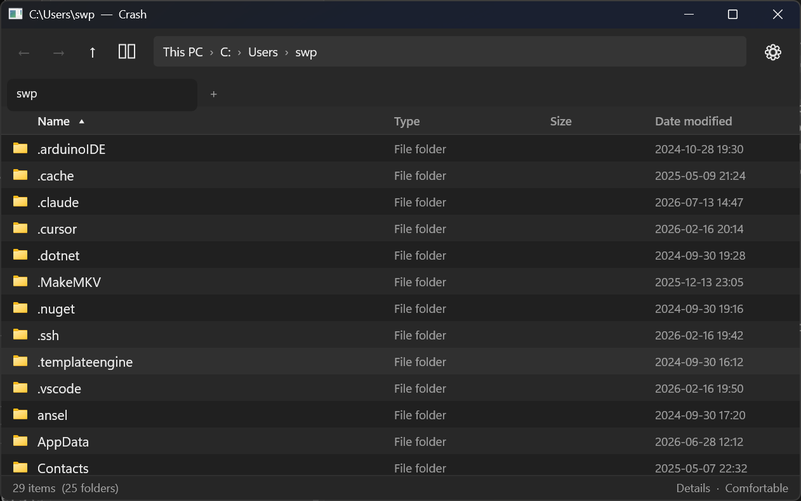

<div align="center">

# Crash

**A Windows file manager named after the thing it refuses to do.**

[](https://github.com/swperb/Crash/actions/workflows/build.yml)
[](LICENSE)


Fast, stable, and visually modern — built on a custom **Direct2D / DirectWrite**
renderer over a plain **Win32** window with a **DirectComposition flip-model
swapchain**. No XAML/WinUI in the hot path.



</div>

Tabs, dual-pane, real thumbnails, a command palette, and instant recursive search
— at **steady refresh-rate scroll on 100k-row folders** with the UI thread never
blocking on disk. Everything you already know from File Explorer, none of the lag.

See [`crash_design_doc.md`](crash_design_doc.md) for the full technical design.

## Highlights

- **Custom virtualized renderer** — Direct2D list/grid, only visible rows drawn,
  no per-item objects; ~165 fps sustained scroll on 100k synthetic rows.
- **Never blocks** — enumeration, thumbnails, and search run on worker threads
  and stream results back; a broken shell extension can't take the process down.
- **Real Windows integration** — shell context menus, system icons, drag-and-drop,
  inline rename, Mica/dark-title chrome that follows your system theme & accent.
- **Power-user layout** — tabs, dual-pane with a draggable splitter, resizable
  columns, marquee select, sessions that restore on relaunch.
- **Search** — instant in-folder filter (free); recursive subtree search that
  works even on network shares, accelerated by [Everything](https://voidtools.com)
  on local drives when installed (Pro).
- **Open core, MIT** — the engine is open source; Pro features sit behind a
  license check ([details](CONTRIBUTING.md#open-core-model)).

---

## Current status: Phase 5 — Fluent polish ✅ (settings + animations)

Crash now has a live settings screen and restrained reveal animations, rounding
out the Fluent look (design doc §4).

### What the polish pass adds

- **Settings screen** — a gear button (and `Ctrl+,` / palette command) opens a
  Fluent settings overlay with segmented controls, all applied **live** and
  persisted to `%LOCALAPPDATA%\Crash\settings.cfg`:
  - **Appearance** — System / Light / Dark, re-themes the *entire* app instantly
    (chrome + every view's brushes + the DWM title bar).
  - **Density** (Comfortable / Compact), **Default view** (Details / Grid),
    **Show hidden files** (re-enumerates), **Thumbnails** on/off, **Animations**
    on/off.
- **Animations** — the command palette and settings overlay fade + slide in on a
  short eased curve (D2D layer opacity + transform). Restrained per §4/§6, and
  **reduced-motion aware**: they snap instantly when the system
  (`SPI_GETCLIENTAREAANIMATION`) or the Animations setting disables them.

*Verified: opened Settings via `Ctrl+,`; clicking Light re-themed the whole app
(and the panel) instantly; System restored it; the overlay revealed with the
fade+slide.*

### Also in this pass

- **Draggable pane splitter** — the dual-pane divider is a grab handle (SIZEWE
  cursor) you drag to rebalance the panes; clamped to a minimum pane width and
  persisted with the session. Narrow panes shed columns responsively.
- **Inline rename** — `F2` on the focused item opens an in-place editor over its
  name (a custom Direct2D field, not a child control); Enter renames via
  `MoveFileW` and reloads, Esc cancels, click-away commits. Blocked in This PC.

*Verified: `F2` renamed `hello.txt` → `renamed.txt` on disk and in the list;
dragging the splitter rebalanced the panes.*

### Mouse interaction

- **Marquee (rubber-band) selection** — drag on empty list space to sweep a
  selection rectangle; intersecting items select live (tracked in content space,
  so it survives scrolling, with edge auto-scroll). Ctrl makes it additive.
- **Drag-and-drop** (`DragDrop.*`, full OLE) — drag selected files out to
  Explorer / other apps / the other pane, and drop files *into* a pane's folder
  (or onto a folder row). Uses a shell `IDataObject` + `DoDragDrop` as source and
  `RegisterDragDrop`/`IDropTarget` + `SHFileOperation` as target (Shift = move,
  else copy).

*Verified: marquee-selected 5 rows with the live rectangle; dragged a file onto a
subfolder and confirmed the copy on disk.*

### Also

- **Resizable columns** — drag the boundary between Details headers (SIZEWE
  cursor) to resize Type/Size/Date; Name fills the rest.
- **Recursive search** *(Pro)* — `Ctrl+Shift+F` (or the palette) searches the
  current folder **and all subfolders**, streaming matches (shown with their
  relative path) as the worker walks the tree. It uses **Everything** as an
  accelerator when it's installed and the root is a **local fixed drive**, and
  otherwise walks the tree directly — which is what makes it work on **network
  shares**, where Everything's MFT-based index doesn't reach (see below).

*Verified: `Ctrl+Shift+F` "License" over `src/` returned License.cpp + License.h
("2 results"); resizing dragged the Name|Type boundary and widened Type.*

## Search & Everything

Everything (voidtools) indexes local NTFS volumes by reading the MFT/USN journal
directly — instant, but it **can't see network shares** (no remote MFT) unless
you add them to Everything's folder indexing or run Everything on the server and
query it over ETP. So Crash uses Everything only for local fixed drives and
**always falls back to its own recursive walker**, which works anywhere
(including UNC / mapped drives), just not instantly. The Everything client
(`Everything64.dll`) is loaded dynamically; if it's absent, Crash walks the tree.

---

## Phase 4 — command palette + search ✅ (first Pro features)

A VS Code-style command palette and in-folder search, wired to the open-core Pro
gate (design doc §6.6, §2.3).

### What Phase 4 adds

- **In-folder search** *(free)* — `Ctrl+F` opens a filter box that narrows the
  current listing as you type; a live `N / M` count and a clear (×) show the
  match state, and a passive chip stays while a filter is applied. Implemented as
  a *filtered projection* in `FileListModel` (no data copied); resets on navigate.
- **Command palette** *(Pro)* — `Ctrl+Shift+P` opens a centered, fuzzy-matched
  palette over ~19 commands (tabs, panes, navigation, view, sort, filter, copy
  path). Arrow keys + Enter, or click, to run.
- **Open-core Pro gate** — the palette is Pro-gated (`License.*`). When locked it
  shows a license-entry prompt; entering a valid key unlocks it and persists to
  `%LOCALAPPDATA%\Crash\license.key`. A real build validates a signed key from the
  commerce backend; the demo key is `CRASH-PRO-2026`.

*Verified: `Ctrl+F` filtered a folder to its matches with a live count;
`Ctrl+Shift+P` showed the Pro gate, the demo key unlocked it, and the palette
then ran "Sort by Size" and "Toggle View → Grid" (fuzzy-matched from "sort si"
and "grid"). Pro persisted across a reopen.*

---

## Phase 3 — thumbnail cache ✅

Grid view shows **real thumbnails** for images, video, PDFs and docs, backed by a
two-tier cache (design doc §5 thumbnail workers, §6.3 cache).

### What Phase 3 adds

- **`ThumbnailCache`** — low-priority background worker threads extract
  thumbnails via `IShellItemImageFactory::GetImage`, so the list **never blocks**
  on paint: a file shows its generic icon immediately and the real thumbnail
  swaps in when ready.
- **Two tiers** — an in-memory LRU of Direct2D bitmaps (instant re-scroll) over
  an on-disk store at `%LOCALAPPDATA%\Crash\thumbs\` (instant re-visit after
  restart). The key is `path + mtime + size`, so editing a file automatically
  invalidates its thumbnail. The disk store is bounded (oldest evicted past a cap).
- **Cancellable per scroll** — each frame reports the currently-visible keys;
  a worker abandons any request that has scrolled off-screen instead of queuing
  it forever. This is the fix for the "3 seconds to load icons" complaint §6.3
  calls out.

*Verified: browsed a 16-image folder in grid — thumbnails generated on the
workers and streamed in; after a full restart they reappeared from disk within
~0.6 s, no regeneration.*

---

## Phase 2 — tabs + dual-pane ✅

Crash is a multi-tab, dual-pane file manager that remembers your layout.

### What Phase 2 adds (design doc §6.5)

- **Tabs** — each tab is its own navigation context (path, history, model, and
  virtualized view). A per-pane tab strip shows every tab with a close (×) and a
  **+** new-tab button. `Ctrl+T` new · `Ctrl+W` close · `Ctrl+Tab` cycle · click
  to switch. Switching tabs is instant — each tab keeps its loaded list, so it
  doesn't re-enumerate.
- **Dual-pane** — toggle the split (toolbar button or `F8`) for two independent
  panes side by side, each with its own tabs, history, and enumeration worker.
  `F6` / `Tab` switches the active pane (accent-underlined); the toolbar and
  address bar act on it. Columns are **responsive** — a narrow pane drops the
  Type/Date columns so Name stays readable.
- **Session persistence** — panes and tabs are saved to
  `%LOCALAPPDATA%\Crash\session.json` on exit and restored on launch (§6.5).
- Tabs and the split are pure **layout state, not separate windows** — creating
  or closing either just adds/removes a lightweight object; there is one
  top-level window throughout.

Everything from Phase 1 (below) still applies per-tab.

---

## Phase 1 — single-pane MVP ✅ (browses the real filesystem)

The Phase 0 renderer is unchanged; Phase 1 added the file-manager pieces.

### What Phase 1 adds

- **Async enumeration pipeline** (`Enumerator`) — a dedicated worker thread lists
  directories with `GetFileInformationByHandleEx` + `FileIdBothDirectoryInfo`
  (documented, ~50× faster than naive `FindFirstFile`, §6.2/§10), streaming
  results to the UI thread in 512-entry batches via a lock-guarded queue +
  `PostMessage` wakeup. **The UI thread never touches disk.** Each navigation
  carries a generation number; a newer navigation cancels the in-flight one and
  the UI discards stale batches.
- **Navigation** — This PC (drive list) → drives → folders; Back / Forward / Up
  with history; address bar; Backspace = up, Alt+←/→ = back/forward,
  double-click / Enter to open (folders navigate, files `ShellExecute`).
- **System icons** (`IconCache`) — real per-extension / folder / drive icons via
  `SHGetFileInfo(USEFILEATTRIBUTES)` converted to Direct2D bitmaps (16px details,
  32px grid), cached by kind. Thumbnails remain a later phase.
- **Chrome** — toolbar (nav buttons + address), status bar (item/folder count,
  load state, live fps), all Direct2D-drawn to match the list.
- **Column sorting** — click any Details header (Name / Type / Size / Date) to
  sort; click again to reverse; a ▲/▼ marks the active column. Folders stay
  grouped first. Size/Date sort on raw values, not display strings.
- **Multi-selection** — Ctrl-click toggles, Shift-click / Shift-arrows extend a
  range, Ctrl+A selects all; a focus outline marks the current item and the
  status bar shows the count. Right-clicking a multi-selection passes the whole
  set of PIDLs to the shell (`GetUIObjectOf`) for one combined menu.
- **Breadcrumb + editable address bar** — the path renders as clickable segments
  (`This PC › C: › Users › swp`); click any to jump there. Click the field, or
  press Ctrl+L / F4, to edit the raw path (select-all, caret editing, paste,
  Enter to navigate, Esc to cancel) — a small custom Direct2D text editor rather
  than a child control, to stay on the composited surface.
- **Shell context menus** (`ShellContextMenu`, §6.4) — right-click (or Shift+F10)
  builds the real menu from the shell (`IShellFolder::GetUIObjectOf` →
  `IContextMenu`), so every installed shell extension appears exactly as in
  Explorer; empty-space right-click shows the folder background menu
  (`CreateViewObject`). `IContextMenu2/3::HandleMenuMsg` is forwarded from the
  window proc so owner-drawn icons and cascading submenus (Send to, Open with)
  work. **Every call into third-party extension code is wrapped in structured
  exception handling** so a crashing extension is contained, not fatal — the
  pragmatic take on §6.4's isolation goal for this stage.

### Verified behavior

Browsed `C:\Users\swp`, drilled into drives and folders, walked Back/Forward/Up,
and toggled Details ⇆ Grid on live data — all correct. Notably, navigating to
**This PC** with a **network drive present** surfaced the §5 golden rule in
action: an early version called `GetVolumeInformationW` on the slow network
drive, which delayed the drive list ~4s — **but the UI stayed perfectly
responsive the whole time** because the stall was on the worker thread, not the
UI thread. Fixed by streaming each drive independently and only reading volume
labels for fast fixed disks. That's the entire structural thesis of the design
validated by an accidental real-world stall.

---

## Phase 0 — renderer spike ✅

Phase 0 is the load-bearing gate (design doc §9): *prove the Direct2D
virtualized list can hit the scroll/paint targets on a synthetic 100k-row
dataset before building anything else.* **It clears the bar with large margin.**

### Measured results (100,000 rows, continuous auto-scroll)

| Metric | §7 target | Measured (165 Hz display) |
|---|---|---|
| Sustained scroll | steady 60 fps / refresh | **165 fps** (vsync-paced), 1% low **161.9 fps** |
| Raw throughput (vsync off) | — | **~376 fps** avg, 1% low **292 fps** |
| CPU / frame | no UI-thread stall | **~2.1–2.4 ms** (list) · **~0.5 ms** (grid) |
| Live text layouts for 100k rows | — | **~28** (details) · **~40** (grid) |

The UI thread uses a small fraction of the frame budget and **never blocks** —
the design's golden rule (§5) holds structurally, not by luck.

### What's implemented

- **Language:** C++20, MSVC. (Rust remains an open re-eval per §10.)
- **GraphicsDevice** — D3D11 device → `IDXGIFactory2::CreateSwapChainForComposition`
  (flip-discard) → DirectComposition visual → Direct2D device context. WARP
  fallback, resize, DPI, and device-lost handling. (`src/GraphicsDevice.*`)
- **VirtualListView** (the core differentiator, §6.1) — custom Direct2D control;
  renders only visible rows + overscan; **no per-item object graph**; details
  and grid are two render modes of the *same* model; per-visible-row
  `IDWriteTextLayout` cache invalidated on resize/mode/density.
  (`src/VirtualListView.*`)
- **Smooth scrolling** (lerp), keyboard nav, hover/selection, and an auto-scroll
  **stress mode** used to prove the scroll target.
- **Compact / Comfortable density** toggle (§4 information-density goal).
- **Live theme** — follows the system light/dark + accent color; Mica backdrop
  + dark title bar via DWM. (`src/Theme.h`)
- **Perf overlay** — QueryPerformanceCounter frame pacing, average + 1%-low fps,
  CPU/frame, and a live §7 verdict.

### Controls

| Key / action | Effect |
|---|---|
| `Ctrl`+`Shift`+`P` | command palette (Pro) |
| `Ctrl`+`F` | filter files in folder |
| `Ctrl`+`Shift`+`F` | search folder + subfolders (Pro) |
| `F2` | rename · drag header border to resize columns |
| `Ctrl`+`,` / gear button | settings |
| `F2` | rename the focused item |
| `Ctrl`+`T` / `Ctrl`+`W` / `Ctrl`+`Tab` | new / close / cycle tab |
| `F8` / dual button | toggle dual-pane |
| `F6` / `Tab` | switch active pane |
| drag the divider | resize dual panes |
| Double-click / `Enter` | open (folder → navigate, file → shell open) |
| `Backspace` / ↑ button | go up |
| `Alt`+← / `Alt`+→ / buttons | back / forward |
| Click breadcrumb segment | jump to that folder |
| `Ctrl`+`L` / `F4` / click address | edit the path, `Enter` to go |
| Click column header | sort by it (again reverses) |
| `Ctrl`-click / `Shift`-click / `Shift`+arrows / `Ctrl`+`A` | multi-select |
| Right-click / `Shift`+`F10` | shell context menu |
| Wheel / ↑ ↓ / PgUp PgDn / Home End | move through the list |
| `G` | toggle Details / Grid |
| `D` | toggle Comfortable / Compact density |
| `S` | toggle auto-scroll stress test |
| `V` | toggle vsync (on = refresh-paced, off = raw throughput) |
| `Esc` | quit |

---

## Build

Requires Visual Studio 2022 with the C++ workload (MSVC + Windows SDK). The
build script imports the MSVC environment and uses the bundled CMake + Ninja.

```powershell
./build.ps1
# -> build/crash.exe
```

## Layout

```
src/
  common.h            COM/platform includes, HRESULT check, DIP helpers
  GraphicsDevice.*    D3D11 + DXGI flip swapchain + DComp + D2D/DWrite
  FileEntry.h         FileEntry + FileListModel (progressive append + sort)
  Enumerator.*        async worker: GetFileInformationByHandleEx + drives
  IconCache.*         system icon (ext/folder/drive) → Direct2D bitmap
  ShellContextMenu.*  real shell right-click menus (IContextMenu, SEH-isolated)
  DragDrop.*          OLE drag source + drop target (SHFileOperation)
  ThumbnailCache.*    background thumbnail workers + LRU + on-disk store
  License.*           open-core Pro gate (license.key, demo unlock)
  Settings.*          user preferences (theme/density/… ) persisted + applied live
  Session.*           save/restore panes+tabs as JSON (%LOCALAPPDATA%\Crash)
  Theme.h             system light/dark + accent → palette
  VirtualListView.*   virtualized details/grid control + multi-select + sort
  main.cpp            panes/tabs, tab strip, dual-pane layout, chrome, enum pump
```

## Not yet built (next phases)

- **Toward release (design §9 Phase 5):** Store listing + real licensing/commerce
  backend, GitHub public release. Plus tagging and saved/indexed full-drive search
  (Everything integration).
- **Smaller follow-ups:** thumbnails in Details view; resizable columns;
  quad-pane; true translucent Mica behind the content.
